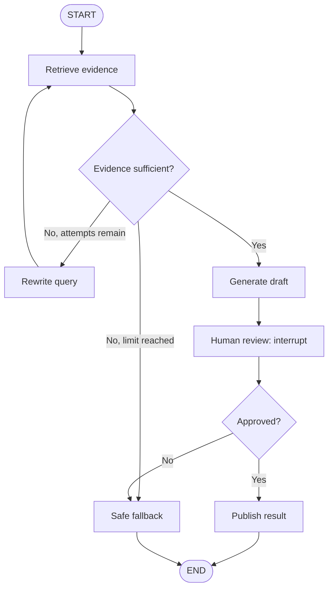

# LangGraph Architecture — Diagram

## Research workflow



State carries the question, evidence, attempt count, draft, and review result. Nodes return updates; the decision points route from state. The loop must have a limit.

## Execution boundary

```text
Graph definition → compile(checkpointer=...) → invoke(input, thread_id)
                                            ↓
                                  checkpoints for this thread
                                            ↓
                             interrupt → review → resume
```

The checkpointer saves progress for the named thread. The external publishing action must be safe if execution is retried or resumed.
