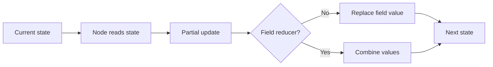
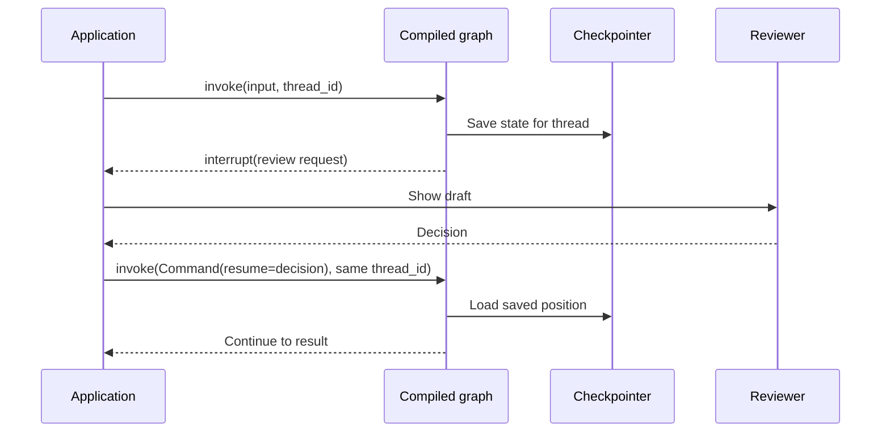

# State, Routing, and Resume — Diagram

## State updates

`MessagesState` uses message-aware update behavior for the `messages` field. Other fields can use their own reducers or normal replacement.

## Thread and review

An interrupted node starts again on resume. Keep actions before the interrupt repeatable.
