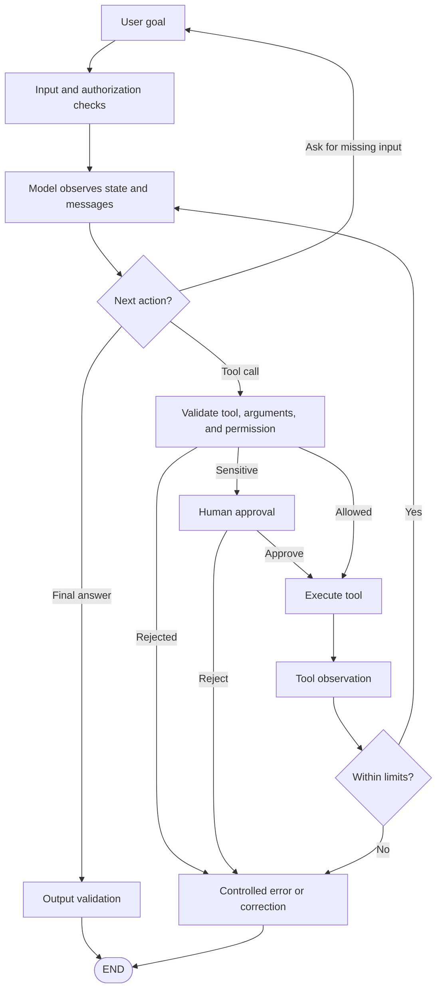

# AI Agent Architecture — Diagram

## Controlled agent loop



The model selects only among capabilities exposed to it. Trusted code owns authorization, validation, approval, execution, and termination.

## Information carried through execution

```text
State
├── messages and tool-call pairs
├── task data and current plan
├── tool results
├── step and retry counters
├── approval status
└── errors and trace metadata

Checkpoint + thread ID
└── preserves relevant state across turns or pauses

Long-term store
└── retrieves selected cross-thread information when relevant
```
