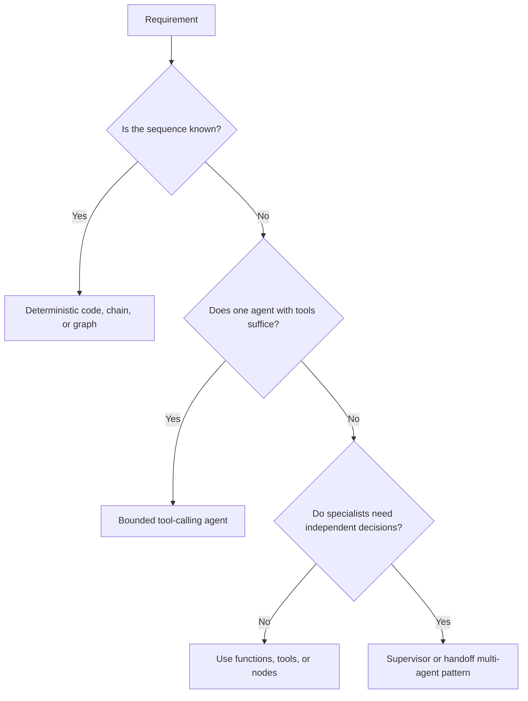
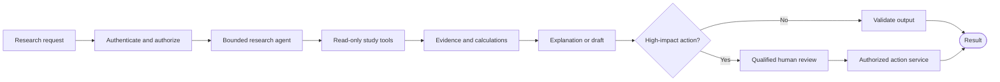

# Agent Patterns and Control Boundaries — Diagram

## Choose the simplest suitable pattern

## Clinical research boundaries

Authorization and predefined monitoring rules remain deterministic. The agent may retrieve, compare, calculate, classify predefined findings, and explain; humans retain clinical, protocol, and regulatory decisions.
